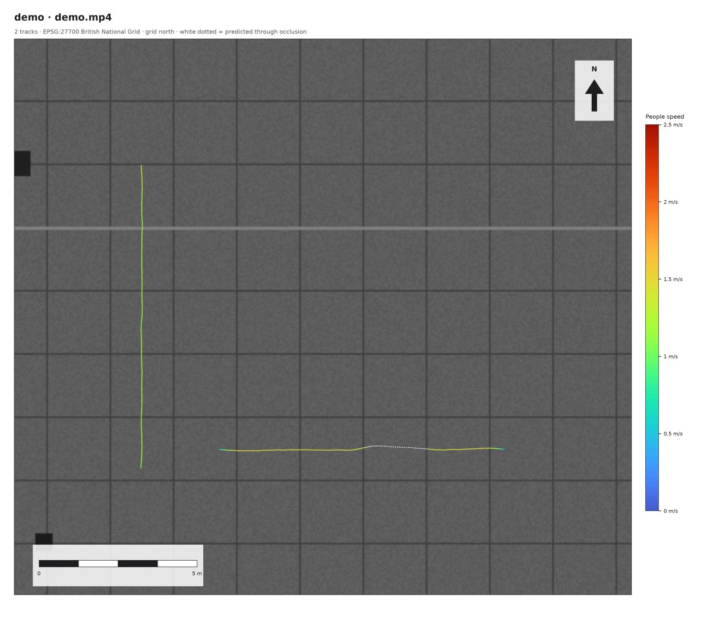
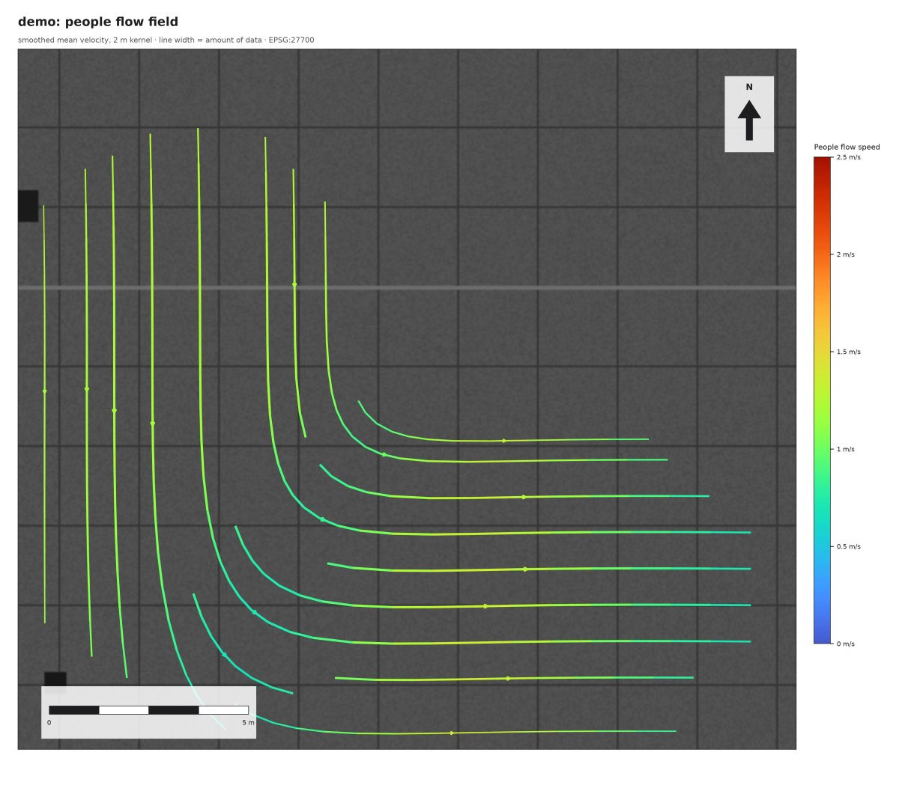
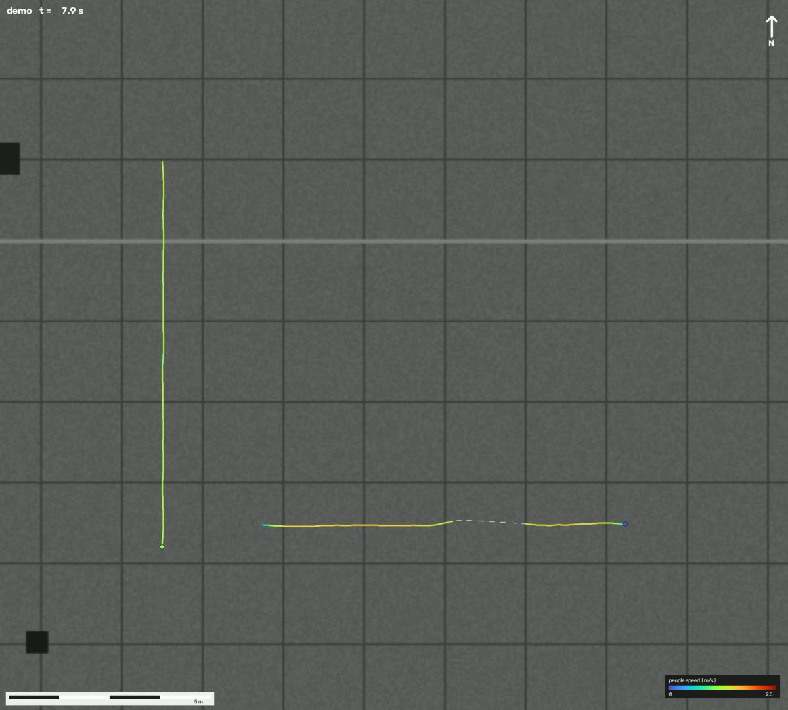

# groundtrack

Turns oblique video, filmed from a fixed tripod or window, into accurate top-down movement
data: tracks in metres in **British National Grid (EPSG:27700)**. The output is ready for QGIS
(maps) and Houdini (particles and paths). Everything runs locally.

| tracks over the map (`topdown.png`) | smoothed flow field (`flow_field.png`) | animated (`topdown.mp4`) |
|---|---|---|
|  |  |  |

*Images from the synthetic demo (`groundtrack demo`): two people walking at known speeds, one
of them behind a pillar (white dotted = tracker prediction through the occlusion).*

```
video ──► 1 DETECT + TRACK ──► raw_tracks.csv          (YOLO26 + ByteTrack / BoT-SORT)
                │
GeoTIFF ─► 2 CALIBRATE (once per site) ──► homography.json   (6–8 clicked point pairs)
                │
          3 PROJECT TO GROUND   foot point → metres, vehicles shifted to their centre
          4 CLEAN + VECTORS     spikes, ID switches, occlusion stitching, Savitzky–Golay,
                │               vx vy speed heading, per-track metrics
          5 EXPORTS             data/: points.csv · tracks.geojson · metrics · stats
                │               houdini/: vector fields + import scripts
          6 VISUALS             <site>_plate.png · images/ (frameless) · labels/ (legends,
                                scale bar, north arrow) · videos/ (with and without labels)
```

Everything runs from the command line or from a small local web page (`groundtrack ui`, §4).

---

## 1. Install

You need Python 3.10–3.12. Use a virtual environment.

### Windows / Linux + NVIDIA GPU

Install the CUDA build of PyTorch. RTX 50-series (Blackwell) cards need **CUDA 12.8 or
newer**, so `cu128` is a safe choice for any recent card:

```powershell
py -3.11 -m venv .venv
.\.venv\Scripts\activate
pip install torch torchvision --index-url https://download.pytorch.org/whl/cu128
pip install -e ".[dev]"
groundtrack device        # -> selected device: cuda:0, GPU: NVIDIA GeForce RTX ...
```

### Apple Silicon (M1–M4)

```bash
python3 -m venv .venv && source .venv/bin/activate
pip install torch torchvision          # the default macOS wheels include MPS
pip install -e ".[dev]"
groundtrack device                     # -> selected device: mps
```

### CPU only

`pip install torch torchvision --index-url https://download.pytorch.org/whl/cpu`, then
`pip install -e ".[dev]"`. This works, but expect a few frames per second. Use `vid_stride: 2` and
`yolo26s.pt`.

`device: auto` in a site config picks **cuda → mps → cpu**. If you ask for `cuda` or `mps`
explicitly and it isn't available, the tool stops with an error rather than quietly running for
hours on the CPU. YOLO weights download into `models/` on first use.

### Try it without footage

```powershell
groundtrack demo --out demo_site
```

This builds a synthetic site: a virtual camera, a GeoTIFF, a video of two people walking at
known speeds, one of them passing behind a pillar. It then calibrates and runs the whole
pipeline. Look in `demo_site/runs/demo/demo/`.

---

## 2. Filming

* **Tripod, locked off.** The homography only holds while the camera doesn't move. Even a slight
  knock means you have to re-calibrate.
* **Stabilisation off** (iPhone: Settings → Camera → Record Video → Enhanced Stabilisation
  off; Android: turn off "video stabilisation"). Electronic stabilisation crops and shifts the
  frame over time, which breaks the calibration.
* **Use the 1× (main) lens.** Don't zoom, and avoid the 0.5× ultra-wide: its distortion bends
  straight kerbs (or use the lens calibration, §3.6). The phone must not switch lenses during a
  take. Lock focus and exposure (long-press on iPhone).
* **Fixed frame rate.** Turn off "Auto FPS" / "Auto Low Light FPS". Variable frame rate makes
  speeds wrong. 1080p30 or 4K30 are both fine.
* **Height helps.** The steeper the view, the more accurate the far field. A first-floor window
  beats street level by a long way.
* **Through a window:** put the lens right against the glass, and shade it with a dark cloth or
  hood. Turn room lights off. Reflections create ghost "people".
* Record the GeoTIFF area generously, and make sure the ground you film has **6–8 sharp,
  identifiable features** that are also visible on the map (§3.1).

---

## 3. Calibration walkthrough (once per site)

### 3.1 Make the georeferenced top-down image

The map must be a **north-up GeoTIFF in EPSG:27700**.

* **Digimap (Aerial / OS MasterMap):** download the tiles as GeoTIFF or JPG with a world file.
  They are already in EPSG:27700.
* **QGIS:** load the imagery (Project CRS = EPSG:27700). Then *right-click the layer → Export →
  Save As… → GeoTIFF*, with *Extent: map canvas* or a drawn box. Alternatively use
  *Project → Import/Export → Export Map to Image* and tick *Append georeference information*.
* 5–25 cm per pixel is ideal. Crop to the site; there's no need for the whole tile.

Good calibration features: kerb corners, road-marking ends, drain covers, bollard bases, paving
joints, lamp-post bases. The point is where the object **meets the ground**, never the top of a
post. Spread them over the **whole** area you care about, near and far, left and right. Don't put
them all in a line.

### 3.2 Set up the site

Your site configs live in `sites/` (kept out of git). `examples/` has commented ones for a
plaza, a motorway, and a per-clip file that extends a shared site config.

```powershell
groundtrack init plaza --template plaza          # writes sites/plaza.yaml
groundtrack init motorway --template motorway    # writes sites/motorway.yaml
```

Copy the video to `footage/plaza.mp4` and the GeoTIFF to `maps/plaza.tif`, or edit the paths
in the YAML. Paths are relative to the YAML file.

### 3.3 Tell it where you stood (strongly recommended)

If you know roughly where the camera was, put it in the site config:

```yaml
camera_position:
  E: 538231            # British National Grid; read it off QGIS or OpenStreetMap
  N: 180557
  height_m: 135        # above the ground you are calibrating (floor x ~3 m + eye height)
  position_tol_m: 15   # how sure you are about E/N (e.g. half the building's footprint)
  height_tol_m: 8
  hfov_deg: 21         # optional starting guess for the zoom: 1x ~65-70, 2x ~35, 3x ~23, 5x ~14
```

Calibration then fits a **real camera** at that spot. Instead of a free homography (8 unknowns),
it solves for direction, tilt, roll and zoom, plus a small position and height correction. In
practice this changes a lot:

* **3 good clicks are enough**, and the guided zoom starts after 2.
* **Bad clicks stand out.** A rooftop or a mis-click can't be explained by any camera at that
  spot, so it gets flagged and the fit is redone without it.
* **No degenerate fits.** Points along one line, telephoto views from far away, and very low
  viewpoints all stop being a problem.
* **The report shows the fitted camera** (direction, tilt, field of view, height), so you can
  sanity-check it against your memory of the zoom you used.

On real footage, from a 43rd-floor window at about 3.5× zoom and from a 2–4 m eye height on a
plaza, this was the difference between calibrations that would not converge and working ones.
`calibrate` also writes `<name>_check_video.jpg`: the map projected into your video, which is
the most readable check for oblique views.

**Ground on several levels: `terrain`.** A homography maps one flat plane. Where people walk on
more than one level, that breaks badly: Trafalgar Square's north terrace is 3 m above the
square, and from the gallery steps a person on the terrace, projected onto the square's plane,
lands tens of metres too far away. Give the site a terrain model and the ground follows it:

```yaml
terrain: auto        # England: the Environment Agency's free 1 m LiDAR terrain model (DTM),
                     # fetched once for the map's extent into maps/dtm/<map>_dtm.tif.
                     # Or a path to any DTM GeoTIFF in British National Grid.
camera_position:
  height_m: 1.8      # now: above the ground right under the camera (a step, the pavement)
```

Every clicked point then sits at its real height, so clicks on the terrace, the steps and the
square all agree, and every foot point is ray-cast onto the terrain instead of one plane. The
calibration file stores the terrain and its datum, so `process` and the Houdini export follow it
too (`points.csv` gains `z`, the ground elevation in metres above sea level). The DTM is bare
ground: under buildings it is interpolated, so for a camera inside a portico or a window,
give `height_m` with a generous `height_tol_m`. Credit on the plate: added automatically.

**Don't know the coordinates?** Look the place up on OpenStreetMap:

```powershell
groundtrack locate "Urbanest Canary Wharf" --floor 43 -c sites/motorway.yaml           # shows it
groundtrack locate "Urbanest Canary Wharf" --floor 43 -c sites/motorway.yaml --write   # saves it
```

It takes the building's centre, sets the tolerance to half its size (you may have stood anywhere
in it) and the height to floor × 3.1 m + 1.5 m (`--height 4` to give it directly). Only the search
text is sent to OpenStreetMap. The same search is in the UI.

### 3.4 Or let it calibrate itself: `autocalibrate`

```powershell
groundtrack autocalibrate -c sites/motorway7.yaml
```

It tries, in this order:

1. **Same spot.** If another site config in the same folder is calibrated and was filmed from
   the same position (any direction, any zoom), the new clip inherits that calibration. Two
   views from one position are related by a single image transform, so this is exact (0.1 m
   in a test), not an estimate. It only works if the two views overlap.
2. **Vehicles on roads** (needs `camera_position` and moving traffic). It tracks the first 30 s
   if there is no run yet, downloads the road lines around the camera from OpenStreetMap
   (only the search box is sent), and solves direction, tilt, roll and zoom so that the
   vehicles drive on roads, along them, at believable speeds, with car-sized footprints. The
   car size sets the scale; without it, a long lens can squeeze every track onto one patch
   of road. If you already clicked points, they are used too.
3. **Walking people** (a plaza, no traffic). People are about 1.70 m tall and walk about
   1.3 m/s, and nobody walks through buildings or the dock (OpenStreetMap outlines). That
   fixes the tilt, the camera height and the zoom. On an open plaza nothing in the footage
   tells which way the camera faces, so **2 clicked points** finish it: open the picker,
   click 2 pairs, press Enter twice (it saves them), then run `autocalibrate`.
4. Then it **checks** the result against the footage: people's height, and the share of
   vehicles on mapped roads.

**With 4 or more clicked points it measures instead of guessing:** every method that applies
(your clicks alone; clicks + walking people; clicks + vehicles on roads; clicks + the clicks of
other clips filmed from the same spot) is fitted again and again, each time hiding one of your
points, and the method whose fits land the hidden points closest wins. On this project:

| clip | your clicks alone | best method | hidden point lands |
|---|---|---|---|
| plaza1 | 1.66 m | + walking people | **0.89 m** |
| motorway2 | 7.00 m | + 2 clicks of motorway5 (same spot) | 6.05 m |
| motorway3 | 4.77 m | + vehicles on roads | 4.55 m |
| motorway5 | 3.59 m | + vehicles on roads | 3.38 m |
| motorway6, plaza2, plaza3 | 3.42 / 2.94 / 0.41 m | your clicks | (kept) |

A calibration you clicked is never overwritten: the automatic one is saved next to it as
`<name>_auto.json` with its own check image, and `--replace` switches to it (keeping a
backup). The UI has the same as a button.

How good is it? On the five motorway clips, with no clicks and no hint about the zoom, it found
the same camera as the hand calibration every time: direction within 1–4°, tilt within 1.5°,
field of view within 2°. On the ground, measured against the clicked map points:

| | median error |
|---|---|
| clicked points (leave-one-out) | 4.2 m |
| clicked points + vehicles on roads | 3.8 m |
| vehicles on roads, no clicks | 9.8 m (5–13 m on four clips, 33 m on one) |

So: without clicks it's good for flows, directions and vector fields, and as a check on a
hand calibration; for metre-level positions, add 3–4 clicks and it uses both.

On the plaza (eye height, people only), walking people + **any 2 clicks** were tested
against the clicks they did not see:

| plaza3 | median error on unseen clicked points |
|---|---|
| clicked points, all but one (the old way, 6 clicks) | 0.41 m |
| walking people + 2 clicks (every possible pair) | 0.56 m (worst pair 3.3 m: two clicks close together) |
| walking people + clicks 2 and 5, through `autocalibrate` | 0.28 m |

Spread the two clicks out (one near, one far, on different sides) and two are enough, **from
a raised spot**. From eye height it did not work: on the two clips filmed at 1.8 m (dock edge),
people + 2 clicks was 5–7 m off (worst pair 27 m), because everyone's head sits on the horizon
and that says almost nothing about the tilt. Those clips' own clicks are also weaker (1.7 and
2.9 m leave-one-out). `autocalibrate` therefore refuses the 2-click shortcut below 2.5 m camera
height and asks for 5+ points. **Filming tip: stand on steps, a wall or a first-floor window;**
3–4 m of height makes both clicking and the automatic methods much more reliable.

### 3.5 Pick the points

```powershell
groundtrack calibrate --config sites/plaza.yaml            # first frame
groundtrack calibrate --config sites/plaza.yaml --time 12  # or a frame with nobody in the way
```

A window opens with the video frame on the left and the map on the right.

1. **Click a point in the video**, then **the same point on the map**. Repeat for 6–8 pairs.
2. **Scroll** to zoom around the cursor; the toolbar's zoom and pan also work. **Right-click**
   or **u** undoes. **Enter** saves, **Esc** cancels.
3. From the 5th pair on, the title shows the live **RMSE** and the worst point. Yellow lines on
   the map go from where you clicked to where the fit puts that point.

You get a report like this:

```
  #        u        v            E            N   err (m)   LOO (m)  inlier
  1     38.5    313.4    529986.50    180013.60     0.076     0.141     yes
  ...
RMSE (inliers): 0.178 m   max: 0.345 m   leave-one-out RMSE: 0.371 m
Camera estimate (sanity check): 9.9 m above the ground at E 529999.4, N 179980.3; focal 1090 px
```

* **err** is the residual at each point; **RMSE** summarises them. The tool **warns if RMSE > 0.5 m**.
* **LOO** (leave-one-out) refits without that point and measures the error there. It's the more
  honest number with only 6–8 points. A point with a much bigger LOO than the others is either a
  bad click or the only point covering its area.
* **inlier = NO**: RANSAC rejected the point (more than 1 m off). Re-check that pair.
* **Camera estimate**: the camera height and position recovered from the homography. If you
  filmed from a 3rd-floor window (~9 m) and it says 25 m, the calibration is wrong even if the
  RMSE looks small.
* Far points are naturally less precise: at a low angle, one pixel can be 0.3 m on the ground.

Outputs go to `calibration/`:
* `plaza_homography.json`: the matrix, errors and camera estimate. Other tools can use `H_world`.
* `plaza_homography_points.csv`: your clicks. Re-running `calibrate` reloads them, so you can fix
  one point instead of starting over.
* `plaza_homography_check.png`: **open this.** The video frame is warped onto the map. Kerbs,
  markings and paving joints should line up. Anything above the ground (people, cars, walls)
  smears, and that's expected.

Non-interactive alternative: `groundtrack calibrate --config ... --points-csv my_points.csv --no-gui`
with columns `u,v,E,N` (for example ground control points you already have).

### 3.6 Optional: lens undistortion

Only worth doing if straight kerbs look visibly bent near the frame edges. Print a checkerboard,
and film or photograph it with the **same phone, lens and resolution** from 10–20 angles:

```powershell
groundtrack lens-calibrate --source checker_video.mp4 --pattern 9x6 --square-mm 25 --out calibration/phone_1x_lens.json
```

Set `lens: ../calibration/phone_1x_lens.json` in the site YAML, then **re-run `calibrate`**: the
picker then shows the undistorted frame. If the lens and homography don't match, the tool
refuses to run.

### 3.7 Optional: region of interest

```powershell
groundtrack roi --config sites/motorway.yaml
```

Click a polygon around the useful ground and press Enter. Leave out the far, blurry end of the
road, the sky, reflections, and parked cars you don't want. Detections whose **foot point** falls
outside are ignored before tracking. The polygon is saved as `sites/<site>_roi.json` and
picked up automatically. It is drawn on the calibration frame, so calibrate first.

### 3.8 If the camera moved: `stabilize`

A homography is only valid for the frame you clicked on. If the phone moved during the clip
(handheld, a railing that flexes, a slowly creeping tripod), set

```yaml
detection:
  stabilize: true
```

Every frame is then aligned to the calibration frame using features on the static
background (ORB + RANSAC; moving people and cars are ignored). Foot points are mapped back into
the calibration frame before projection. The calibration remembers which frame you clicked on
(`--frame` / `--time`), and the run log reports how far the camera moved and whether any frames
failed to align. Both templates have it on.

On the synthetic demo with a ~2° handheld-style sway, the camera drifts up to 68 px. Position
error is **0.14 m with `stabilize`** and **2.1 m without**, and speeds are off by 15 % without
it. Rotation (the usual handheld wobble) is compensated exactly. Walking around with the phone
is not: if the camera *position* moves by more than a few centimetres, film again from a fixed
spot.

Calibrate first, then track: tracking with `stabilize` aligns to the calibration frame. If you
re-calibrate on a different frame, re-run `track`.

---

## 4. Running both sites

**Prefer buttons?** `groundtrack ui` opens a local page in your browser (served from this
computer only, nothing is uploaded). Pick a site, look up where you stood, open the point picker,
start a run and watch its log, then browse every result: frameless images, label PNGs, metrics,
videos and data, each with a download link. Every button runs the same command as below.

```powershell
groundtrack ui                      # from the project folder (the one with sites/ and runs/)
```

From the command line:

```powershell
groundtrack run --config sites/plaza.yaml
groundtrack run --config sites/motorway.yaml
```

**Several clips from different camera positions?** Each position needs its own calibration
(and ROI). Keep the shared settings in one site file and add one small file per clip:

```yaml
# sites/motorway2.yaml
extends: motorway.yaml            # everything else comes from the shared site config
site: motorway2                   # -> runs/motorway2/...
video: "C:/.../Motorway2.mov"
homography: ../calibration/motorway2_homography.json
```

Then `groundtrack calibrate -c sites/motorway2.yaml`, `groundtrack roi -c sites/motorway2.yaml`
and `groundtrack run -c sites/motorway2.yaml`. Clips filmed from the *same* position can share a
homography file.

Each run writes a new folder, `runs/<site>/<YYYYmmdd-HHMMSS>/`. Detection is the slow part.
After changing cleaning, grid, stats or visual settings, re-run only the fast stages:

```powershell
groundtrack process --config sites/plaza.yaml --run latest      # or --run 20261007-153000
groundtrack track   --config sites/plaza.yaml --max-frames 300  # quick look at the first 10 s
```

Defaults that matter, with suggested values per site:

| setting | plaza | motorway | why |
|---|---|---|---|
| `detection.model` | `yolo26m.pt` | `yolo26m.pt` | `l`/`x` find more small, far objects but run slower |
| `detection.imgsz` | 1920 | 1920 | larger = smaller objects found. Measured: 1920 found 34 % more people than 1280 on a plaza clip filmed from steps (17 % more tracks) and 13 % more on a full eye-level clip, at about the same speed |
| `detection.conf` | 0.25 | 0.2 | measured on a full high-rise clip: 0.2 found 19 % more vehicles than 0.3, with 42 % longer unbroken tracks; BoT-SORT vs ByteTrack and a longer `track_buffer_s` made no clear difference |
| `detection.tracker` | `botsort` | `bytetrack` | both work; BoT-SORT is a little steadier in crowds |
| `detection.track_buffer_s` | 1.5 | 1.0 | how long a lost object is predicted before it's dropped |
| `groups.*.speed_range` | people 0–2.5 m/s | vehicles 0–35 m/s | colour ramp limits |
| `groups.*.smooth_window_s` | 1.0 | 0.6 | longer = smoother, but sharp turns get rounded |
| `cleaning.min_track_s` | 2.0 | 1.0 | drop flickers |
| `grid.cell_size_m` | 1.0 | 2.0 | field_grid resolution |
| `stats.count_lines` | entrances | one per carriageway | directional counts and flow/min |

Classes come from `groups`: each group lists its COCO classes (`person`, `bicycle`, `car`,
`motorcycle`, `bus`, `truck`) and carries its own physics (max plausible speed, smoothing,
ground offset, colour range). Remove a group to stop tracking it. Every option, with comments,
is in `groundtrack/config.py` (`DEFAULTS`).

### People and vehicles in one clip

Every class goes into a group (`groups:` in the config) with its own speed range, smoothing
and ground point (people: feet; vehicles: shifted to the vehicle centre). A config that lists
both `people` and `vehicles` tracks both at once. The data, statistics and vector fields come
per group (`vector_field_<group>.csv`, `field_grid_<group>.csv`); in the images, videos and
plate every track is coloured on its own group's speed scale, there is one speed legend per
group (`labels/legend_speed_<group>_*.png`), and the flow-field video streams each group
through its own field.

**Trains, trams, metros.** A `trains` group (`classes: [train]`) tracks rail vehicles. They
often run on viaducts, and a train's box bottom is then on the deck, not on the street: projected
onto the ground it would land several metres too far away. `plane_height_m` projects a group onto
a raised plane instead; `auto` (the default for trains) tries heights from 0 to 25 m and keeps the
one where the tracks line up with the OpenStreetMap rail lines that are above ground (tunnels and
underground lines are left out). On the DLR beside the A1261 the trains line up with the mapped
rail at the calibrated surface itself, 2 m median.

### Vehicle ground point (read this for the motorway)

The bottom-centre of a car's box is where the car's footprint is **closest to the camera**. That
is not the car's centre. The tool offers two corrections:

* `offset_mode: travel` (as specified): shift the point **back along the direction of travel**
  by `ground_offset_m` (2.2 m by default; buses and trucks are set larger in the template). This
  is right for traffic **coming towards** the camera. For traffic **driving away**, the box
  bottom is the *rear* bumper, so this shifts the point the wrong way: about 4.4 m off in total.
* `offset_mode: view` (**recommended when you can see both carriageways**): shift the point
  **away from the camera** by the footprint's half-extent in that direction: half the length
  when seen end-on, half the width side-on, blended in between. It uses the camera position
  recovered from the homography, so it is correct for both directions and for curving roads.

The motorway template uses `travel`, as the brief asked. Switch it to `view` if you film both
directions.

### Machine-made gaps

Every row in `points.csv` has a `source`, and anything other than `detected` has `predicted=True`:

* `predicted`: the tracker's Kalman prediction while the object was hidden. Kept only if the
  object is found again; predictions trailing off after something leaves are thrown away.
* `stitched`: the tracker lost the object and later gave it a new ID. groundtrack re-linked the
  two fragments **in ground coordinates**, because the new one started where the old one was
  heading, within `stitch_radius_m`. Small, distant people behind columns often need this.
* `interpolated`: a single bad detection (a jump) that was removed and filled in.

In `topdown.png` these segments are white and dotted. `predicted_gaps.geojson` holds them as
separate lines for QGIS. `field_grid.csv` and `density.png` leave them out by default
(`grid.include_predicted`).

---

## 5. Outputs (one folder per run)

Each run writes `runs/<site>/<run>/`, sorted by what you use it for:

```
<site>_plate.png    the complete plate: in situ | plan, key figures, legend
images/             frameless images (no title, frame, axes, legend or scale bar)
labels/             the legends, scale bar and north arrow, on their own
videos/             overlay / topdown / flowfield .mp4, and *_clean.mp4 without any labels
data/               metrics, tracks and statistics: for QGIS and spreadsheets
houdini/            the import scripts and the CSVs they read (self-contained)
extras/             the maps with legends (topdown, flow field, density, speed histogram)
_working/           tracker output, camera motion, config + calibration snapshot, log
```

**images/ and labels/** are for layouts: import only the picture, or only the legend.

| file | contents |
|---|---|
| `images/insitu_frame.png`, `insitu_tracks.png` | the mid-clip video frame (people blurred, aligned to the calibration frame), and the same, darkened, with every track as a thin light trail |
| `images/plan_aerial.png`, `plan_map.png` | the aerial at the plan extent, in colour and darkened (the base of the others) |
| `images/plan_tracks.png`, `plan_flowfield.png`, `plan_density.png` | tracks, vector-field streamlines (only where the flow is well supported and one-directional) and occupancy |
| `images/*_layer.png` | the same drawings alone on transparency, to stack in Photoshop / InDesign / Illustrator. All `plan_*` images and layers share one extent and size |
| `labels/legend_speed`, `legend_density`, `scale_bar`, `north_arrow` | `_light` (white ink, for dark backgrounds) and `_dark`, transparent. The scale bar is drawn at the plan images' pixel scale: resize the two together. `title.txt` holds the plate text |
| `<site>_plate.png` | the complete plate. Its text comes from `package:` in the config (`title`, `index`, `subtitle`, `date`, `credit`). Redraw images and plate with `groundtrack package -c ... --run ...` (`package: enabled: false` turns images, labels and clean videos off) |
| `videos/overlay.mp4` | overlay on the original video, only with `--debug-video` (or `groundtrack debug-video`); people blurred unless `--no-blur`. Default **clean** style: only the tracks that survive cleaning, as smoothed trails coloured by speed with a dot and a thin box (same colour; `debug_video.boxes: false` hides it) at each current position, over a slightly dimmed picture that is aligned to the calibration frame (no camera shake). `--boxes` writes the full debug view (boxes, IDs, rejected tracks in grey) as `overlay_boxes.mp4`, `--trail-s 5` keeps only the last 5 s. Colour = real m/s once calibrated, approximate m/s from body height before that |
| `videos/topdown.mp4` | the same, animated: trails build up over the map with a dot at each current position, legend, scale bar and clock (`visuals.topdown_video`, `topdown_video_speedup`) |
| `videos/flowfield.mp4` | particles streaming through the smoothed vector field over the map, coloured by speed: the same field `houdini_field.py` gives a particle sim (`visuals.flowfield_video`) |
| `videos/*_clean.mp4` | the same videos without clock, legend, scale bar or title |
| `data/metrics.csv`, `metrics.json` | the key figures (tracks, speeds, flow, duration, camera, calibration error, people check); the JSON adds every statistic and the plan images' extent in EPSG:27700 and pixels per metre |
| `data/points.csv` | `track_id, class, frame, time_s, x, y, vx, vy, speed, heading, predicted, source, group`. x/y in EPSG:27700 metres, v in m/s, heading in degrees clockwise from grid north |
| `data/track_metrics.csv` | per track: duration, path length, straight-line distance, straightness, mean/median/max speed, start/end, numbers of predicted and stitched samples, original tracker IDs |
| `data/tracks.geojson` | one LineString per track (EPSG:27700) with the summary as attributes |
| `data/predicted_gaps.geojson` | only the machine-made stretches |
| `data/field_grid.csv` | world-aligned grid: `cell_x, cell_y, mean_vx, mean_vy, mean_speed, flow_speed, heading, coherence, count, n_tracks`. `count` = number of samples (your confidence); `coherence` is 1 when everyone moves the same way and 0 when flows cancel. `field_grid_<group>.csv` is written when there are several groups |
| (flow) | for traffic, put a `count_lines` entry across the road: those crossings, by direction, are the flow. The per-group "tracks" number also counts fragments and side roads |
| `data/stats.json`, `stats.csv` | per class and group: tracks, flow per minute (as a time series and a mean), mean/median/85th-percentile speed, speed histogram, mean straightness, plus count-line crossings |
| `houdini/` | `houdini_import.py`, `houdini_field.py` (§6) and the `points.csv` / `vector_field*.csv` they read |
| `extras/topdown.png` | tracks over the dimmed GeoTIFF, coloured by speed blue → red, with a separate scale per group, scale bar and north arrow, 300 dpi |
| `extras/flow_field.png`, `density.png`, `speed_histogram.png` | streamlines, occupancy (object-seconds per m²) and mean speed per track, with legends |
| `_working/raw_tracks.csv` | the tracker output in pixels (`bbox`, `confidence`, `predicted`) |
| `_working/config_used.yaml`, `homography_used.json`, `run_log.txt` | provenance |

Runs made with an older version are moved into this layout the first time you open or
re-process them.

**QGIS:** drag `tracks.geojson` in; it carries its CRS. For `points.csv` or `field_grid.csv`, use
*Layer → Add Delimited Text Layer*, with X = `x` / `cell_x`, Y = `y` / `cell_y`, CRS EPSG:27700.
To draw arrows for the field grid, use the *Geometry Generator* or the *Vector Field Marker*
symbology with `mean_vx` / `mean_vy`.

---

## 6. Houdini import

1. Create a *Geometry* node. Inside it, add a **Python** SOP (*Python Script*).
2. Paste the contents of `runs/<site>/<run>/houdini/houdini_import.py` into its code box. Or
   paste this one-liner, which re-reads the file each cook:
   ```python
   exec(open(r"C:/path/to/runs/plaza/20261007-153000/houdini/houdini_import.py").read())
   ```
3. You get one point per sample with `track_id, class, group, frame, time_s, v` (velocity, m/s),
   `speed, heading, predicted` and `Cd`. There's one open polyline per track (with prim attribs
   `track_id`, `class`), and detail attribs `origin_E`, `origin_N`, `origin_Z`. With a terrain
  model (§3.3) each point sits at the height of the ground under it (Y), relative to `origin_Z`
  (metres above sea level): the terrace walkers are 3 m above the square.

* **Axes:** Houdini is Y-up, so Easting → **+X** and Northing → **−Z**. North is up in the *Top*
  viewport. Coordinates are relative to the site origin (float32 can't hold BNG coordinates to
  the centimetre); add `origin_E/N` back for real-world positions.
* **Colour:** `Cd` uses the same blue → red ramp and per-group speed ranges as the PNGs (in linear
  colour). Predicted samples are darkened (`PREDICTED_DIM`).
* **Particles:** set `MODE = "current"` at the top of the script. You then get one point per track
  alive at the current time (`time_s = $T × TIME_SCALE + TIME_OFFSET`), with `v` set. Use it as a
  POP Source (emit from *all points*, *Use Inherited Velocity*) or in a POP Wrangle to steer agents.
  For trails, keep `MODE = "tracks"` and blast with `@time_s > $T`.

### Vector field for particle sims (`houdini_field.py`)

Every run also writes a **smoothed top-down vector field**:

* `vector_field.csv`: one row per grid cell (`field.cell_size_m`, aligned to British National
  Grid) with `vx, vy, speed, heading, density, weight, confidence, dominance`. It's a
  kernel-weighted average of the measured velocities (Gaussian, `field.smooth_m`). Speeds stay
  real, and the field fades out where there's no data instead of inventing motion there. With
  several groups you also get `vector_field_<group>.csv`, so cyclists don't speed up the
  pedestrian field.
* **Direction-aware.** Each cell follows its *dominant* direction (`field.direction_bins: 8`
  heading sectors). A plain average would cancel two opposite streams close together (two
  carriageways, a two-way footpath) into a slow band between them; on the motorway clips that
  band covered 12 % of the field, now 4 %. `dominance` says how one-way a cell is (1 = all in
  one direction, ~0.5 = two equal opposite streams). `direction_bins: 0` gives the plain average.
* `vector_field_slices.csv`: the same field per `field.time_window_s` window (motorway default
  10 s), to animate traffic pulses.
* `flow_field.png`: streamlines of the field over the map; colour = speed, line width = how
  much data supports it.

In Houdini, make one Python SOP per role and set `MODE` at the top of `houdini_field.py`:

| MODE | gives you | use it for |
|---|---|---|
| `"volume"` | volumes `vel.x`, `vel.y`, `vel.z` (m/s), `density`, `confidence` | velocity field for POP Advect by Volumes |
| `"points"` | a point per cell with `v`, `speed`, `density`, `confidence`, `Cd`, `pscale` | arrows (Visualize `v`, or Copy to Points a line), guides, scattering |
| `"sources"` | points where tracks **start** (group `sources`) and **end** (group `sinks`) with `v`, `time_s`, `class` | emitters that match where people or vehicles really enter |

`GROUP = "people"` picks a group's field. `USE_TIME_SLICES = True` animates the field with `$T`.
`FADE_BY_CONFIDENCE` (on) scales velocity by confidence, so particles slow down gently at the
edge of the observed area instead of hitting a wall.

**A minimal particle sim**

1. `field`: Python SOP, `MODE = "volume"`.
2. `emit`: Python SOP, `MODE = "sources"`, then a Blast that keeps group `sources`. Or scatter
   points onto the `density` volume to emit where people actually are.
3. DOP Network → **POP Object** + **POP Source** (geometry from `emit`, *Emission Type: All
   Points*, a constant birth rate, *Initial Velocity: Use Inherited Velocity*) → **POP Advect by
   Volumes** (*Velocity Source: SOP*, path to `field`, *Velocity Volume*: `vel`, *Advection
   Type: Update Velocity* to follow the measured flow exactly, or *Update Force* for a looser,
   more organic follow) → optionally **POP Drag**.
4. Keep particles on the ground: POP Wrangle `@P.y = 0; @v.y = 0;`. Kill them where
   `confidence` is near 0 with a Volume Sample in a POP Wrangle.

If a node wants a VDB vector field: Convert VDB on the three `vel.*` volumes, then VDB Vector
Merge → `vel`. The axes and origin are the same as `houdini_import.py`, so the field, the
measured tracks and the particles all line up.

---

## 7. Ground-truth check

Measure the real accuracy at each site. The procedure takes five minutes.

1. Pick two ground points **A** and **B** 10–20 m apart, in the area you care about, with nothing
   in between. Read their coordinates in QGIS on the GeoTIFF (or tape-measure the length).
2. Film from the **exact same camera position**: stand still on A for 3 s, walk at a steady pace
   in a straight line to B, then stand still on B for 3 s.
3. Run:
   ```powershell
   groundtrack groundtruth --config sites/plaza.yaml --video footage/walk_test.mp4 `
       --start 529995.5 180005.0 --end 530004.5 180005.0
   # or without coordinates: --length 12.0   (length and speed only)
   # optional: --stopwatch 8.4   (walking time you measured), --track-id 3
   ```
4. Read the verdict, `groundtruth_report.json` and `groundtruth.png`:
   * **length error %**: the scale of the calibration (target within 3 %);
   * **speed error %**: the tool's speed against a reference that doesn't depend on the
     calibration: 80 % of the known length ÷ the video time between passing the 10 % and 90 %
     marks of the walk (or your `--stopwatch` time). Target within 5 %;
   * **start/end error**: absolute position while you stand on A and B (target < 0.5 m);
   * **lateral RMS**: wobble of the projected path around the straight line (target < 0.3 m).

On the synthetic demo (`groundtrack demo`, then `groundtrack groundtruth` on its video with A/B)
the tool scores 4–5 cm end-point error, -0.2 % length error, 0.1 % speed error and 5 cm lateral
RMS. Real footage will be worse; that's what this check is for.

---

## 8. Accuracy notes and limitations

* **Low viewpoints: limit the range.** Each pixel covers more ground the further away and the
  flatter the view: roughly distance² ÷ (focal length × camera height). From 2–3 m eye height,
  one pixel of foot jitter is about 0.1 m at 20 m but more than 0.5 m at 50 m. That inflates
  speeds and breaks tracks. Set `projection: max_range_m` (for example 30–40 m on a plaza) to
  only measure where the geometry is good. On a real plaza clip this brought the median walking
  speed from an implausible 1.8 m/s down to 1.2 m/s, and cut impossible jumps by 90 %.
  `max_range_m: auto` (the template default) works it out per group from the calibrated camera:
  people are kept while one pixel is under 0.25 m of depth, cycles 0.4 m, vehicles 1 m.
* **Lane check (real ground truth, no extra filming).** The aerial shows the painted lane
  markings to ~10 cm. Every run with vehicles compares each long, straight track with the
  lane direction under it (`stats.json` → `tracking_check`): a calibration rotation shows as
  one consistent sign, and the sideways scatter of straight tracks is an upper bound on
  position noise. On this project's motorway clips the hand calibrations ran 0.7–2.2° off
  the lanes; after the leave-one-out method choice 0.1–0.9°. Straight tracks scatter
  sideways by a median 23–79 cm (gentle curves count as scatter too). The check uses
  direction-unbiased Gaussian derivatives: a plain Sobel filter is off by up to 0.8°, as much
  as the effect being measured (`test_lane_check_measures_a_known_rotation`).
* **People check.** Every walking person is a measuring stick. Each run computes how tall the
  detected people would have to be under the calibration, writes it to `stats.json`
  (`calibration_check`) and logs it. About 1.7 m means the calibration is consistent. A large
  error from a high camera points at the zoom or the tilt. From eye height, it mostly reflects
  the camera height and can be off while the ground positions are still fine (the click error is
  the better measure there).
* **Flat ground.** A homography maps one plane. Steps, ramps or a cambered road put objects off
  that plane, and they get projected as if they were on it. Set `terrain: auto` (§3.3) and the
  ground follows the Environment Agency's 1 m LiDAR model instead: terraces, steps and slopes.
  Without it, for a stepped plaza calibrate on the main level and only use points on that level
  (or set the ROI to it). The automatic road and people fits still assume one flat ground; with
  a terrain model they are only used for checking, and clicked points do the fitting.
* **Foot point.** A person's box bottom is their feet, which is good. A partly hidden person (a
  bollard covering their feet) gets a box that ends higher up, and is projected slightly *further
  away*. You can see this as a small kink just before an occlusion.
* **Partly hidden people.** When a railing, a sign or another person hides someone's legs, the
  box gets shorter from the bottom and the foot point jumps away from the camera. Each track
  keeps a robust normal box height; when a box is clearly shorter and its *bottom* edge is the
  one that moved, the feet are rebuilt as top + normal height (`recover_occluded_feet`). If the
  *top* moved instead (a gantry, an umbrella), the real bottom is kept. On a crowded plaza clip
  this repairs ~7 % of all boxes.
* **Boxes cut off by the bottom of the frame** are dropped, because their "feet" are really
  their waist (`edge_margin_px`).
* **Parked vehicles** are dropped: vehicles that never move more than `min_displacement_m`
  (5 m). Standing people are kept on purpose, because dwelling is data.
* **People on bicycles** are dropped as `person` when they sit on a detected bicycle
  (`suppress_riders`), so they are counted once, as a bicycle.
* **Speeds** come from the derivative of the smoothed path, so they are as good as the
  calibration scale. Check with §7. Headings are relative to **grid north**, which differs from true north
  by up to a few degrees depending on how far east or west the site is (zero at 2° W).
* **Field grid and density are time-weighted.** A slow walker leaves more samples per cell than a
  runner, which is what you want for occupancy, not for counts. For counts, use `count_lines`.

---

## 9. Troubleshooting

| symptom | fix |
|---|---|
| `groundtrack device` says cpu on the NVIDIA laptop | you installed the CPU wheel: `pip uninstall torch torchvision` and reinstall from the `cu128` index (§1); update the NVIDIA driver |
| calibration RMSE > 0.5 m | spread the points out, use ground-contact features, zoom in before clicking, check the map really is EPSG:27700, film with **stabilisation off** and the **1× lens** |
| check image lines up at the centre but not at the edges | lens distortion: use the 1× lens, or run `lens-calibrate` (§3.6) |
| speeds drift over a long recording | the camera moved (tripod knocked, window flexing); re-calibrate on a frame from that part |
| ghost tracks over windows / glass | **avoid window reflections**: lens against the glass, dark cloth, room lights off; mask with an ROI |
| many short broken tracks | increase `imgsz` or use a bigger model; raise `track_buffer_s`; check `stitch_radius_m`; set an ROI to cut the blurry far field |
| car/truck/bus labels flicker | handled: each track gets a confidence-weighted majority class |
| `Video is 3840x2160 but the homography was calibrated on 1920x1080` | calibrate on a frame of the same footage settings |
| speeds about 2× or 0.5× too high or low | the phone recorded at variable fps or the container lies: set `fps:` in the config, and turn off Auto FPS |
| slow on a laptop | `vid_stride: 2` (halves the work; speeds are still right), `yolo26s.pt`, ROI |
| picker window doesn't open | needs a desktop session (Tk); over SSH, use `--points-csv ... --no-gui` |

---

## 10. Privacy

* Only bounding-box coordinates are stored. **No face crops, no images of people, no
  appearance embeddings, no identities.** ReID is off, and track IDs are arbitrary numbers that
  are only meaningful within one video.
* The overlay video (`videos/overlay.mp4`) is **off by default**. When you do render it, people
  are **blurred** unless you pass `--no-blur`. Don't share an unblurred overlay video.
* **Number plates** are blurred too, in the overlay videos and the in-situ images: the lower part
  of every vehicle close enough for its plate to be readable (`debug_video: blur_plates`, on by
  default). Like the people blur, it relies on the detections: a vehicle the detector missed
  is not blurred, so look through a video before sharing it.
* **Delete the raw footage once you've processed it and checked the run.** `points.csv`,
  `tracks.geojson` and the rest contain everything the research needs. In PowerShell:
  `Remove-Item footage\plaza.mp4`. On macOS: `rm footage/plaza.mp4`, then empty the Bin. Also
  delete the copies on your phone and in its cloud backup (iCloud / Google Photos "Recently
  deleted"), and any unblurred overlay video. Keep the calibration `.json` and `_points.csv`
  files: they hold no personal data. The check images next to them (`*_check.png`,
  `*_check_video.jpg`) show the calibration frame. People and plates in it are blurred when
  the clip was tracked before calibrating; if not, delete the check images with the footage.
* If the footage might show identifiable people, follow your institution's ethics and data
  protection guidance (UK GDPR). Signage at the site and short retention periods are standard
  practice.

---

## 11. Tests

```powershell
pytest                 # everything, including the end-to-end run (~40 s on the GPU)
pytest -m "not e2e"    # unit tests only (~1 min, most of it the automatic calibration)
```

* `test_homography.py`: exact recovery on a synthetic camera, click noise, a rejected bad click,
  the RMSE warning, the horizon, the save/load round trip.
* `test_trajectories.py`: smoothing and velocity on a straight line and a circle, heading hold,
  spike removal, splitting at an ID switch, vehicle offsets (both modes), camera recovery from
  the homography, end-to-end `process_tracks` on synthetic boxes, the class majority vote.
* `test_exports.py`: grid aggregation and alignment, GeoJSON validity (including reading it with
  GDAL), the predicted-gap GeoJSON, count-line directions, the stats table. The Houdini script is
  run against a stub `hou` module.
* `test_field.py`: the vector field keeps speeds, keeps opposite lanes apart (also when they are
  closer than the kernel), density units, time slices, the Houdini field script.
* `test_selfcal.py`: the people-height check on a synthetic camera, `max_range_m: auto`.
* `test_autocal.py`: same-spot transfer recovers a known camera exactly and refuses unrelated
  views; vehicles on roads recover direction, tilt and zoom of two synthetic cameras.
* `test_package.py`: a clip with people and vehicles: each group on its own colour scale,
  legends and figures per group, the two-field flow-field video.
* `test_layout.py`: the run folder layout, and moving runs made by older versions into it.
* `test_ui.py`: the local UI only accepts its own configs, files inside the project, known
  commands and safe run names; it refuses other hostnames and cross-site posts; the camera
  position is written into the config without touching the rest.
* `test_e2e.py`: generates the demo video, runs calibration, YOLO, tracking and all exports, then
  checks positions (within 25 cm), speeds (within 6 %), the occlusion bridging, the package (every
  plan image and layer stacks, the metrics) and the `groundtruth` command.

---

## License

AGPL-3.0, matching [Ultralytics](https://github.com/ultralytics/ultralytics), whose YOLO models
and trackers this tool builds on. See `LICENSE`.
